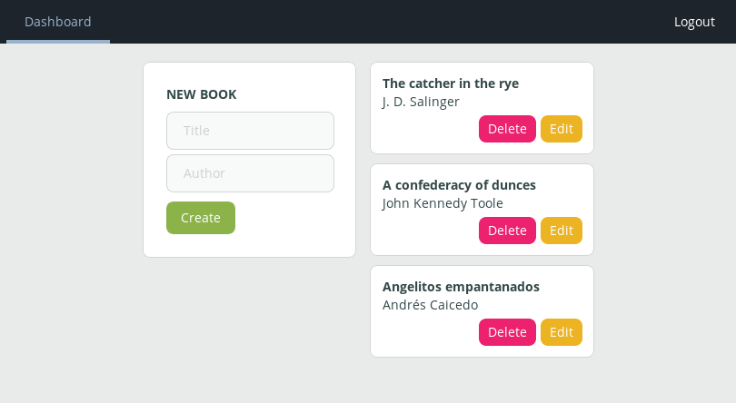

# Book CRUD

A simple CRUD (Create, Read, Update, Delete) application built on [Django Rest Framework][drf], [Nuxt.js][nuxt] and [Nginx][nginx].

It includes:

- Automatic HTTPS with Let's Encrypt and [Certbot][certbot].
- Basic captcha for sign up form.

As a user you would be able to:

- CRUD book entries.
- Login and logout.
- Sign up.

## Installation

All you need is [Docker][docker] and [Docker Compose][docker-compose]. Make sure you have them. Then:

```bash
# 1. Download this repo.
git clone https://github.com/luvejo/bookcrud

# 2. Well... you know.
cd bookcrud

# 3. Build and run.
docker-compose -f local.yml up --build
```

Go to http://127.0.0.1.



## Development

In order to interact with a service, you could run:

```bash
docker-compose -f local.yml run --rm $SERVICE_NAME $COMMAND
```

For example, if you want to run the django shell, exec:

```bash
docker-compose -f local.yml run --rm django python manage.py shell
```

## Deploying

Rename `.envs/.production.example` as `.envs/.production` and customize it. Then just:

```bash
# 1. Connect to your server
ssh $YOUR_SERVER

# 2. Download this repo.
git clone https://github.com/luvejo/bookcrud

# 3. ¯\_(ツ)_/¯
cd bookcrud

# 4. Build and run.
docker-compose -f production.yml up --build
```

**Note**: set `STAGING_ENV` to `False` to request a production Let's Encrypt certificate. If you're just testing, the default (`True`) will prevent hitting [rate limits][staging-env] too early.

[drf]: https://www.django-rest-framework.org "Django Rest Framework"
[nuxt]: https://nuxtjs.org "Nuxt.js"
[nginx]: https://nginx.org/ "Nginx"
[certbot]: https://certbot.eff.org/ "Certbot"
[docker]: https://docs.docker.com/install/ "Docker"
[docker-compose]: https://docs.docker.com/compose/ "Docker Compose"
[staging-env]: https://letsencrypt.org/docs/staging-environment/ "Let's Encrypt Staging Environment"

## License

This project is licensed under the MIT License. See the [LICENSE](LICENSE) file for details.
